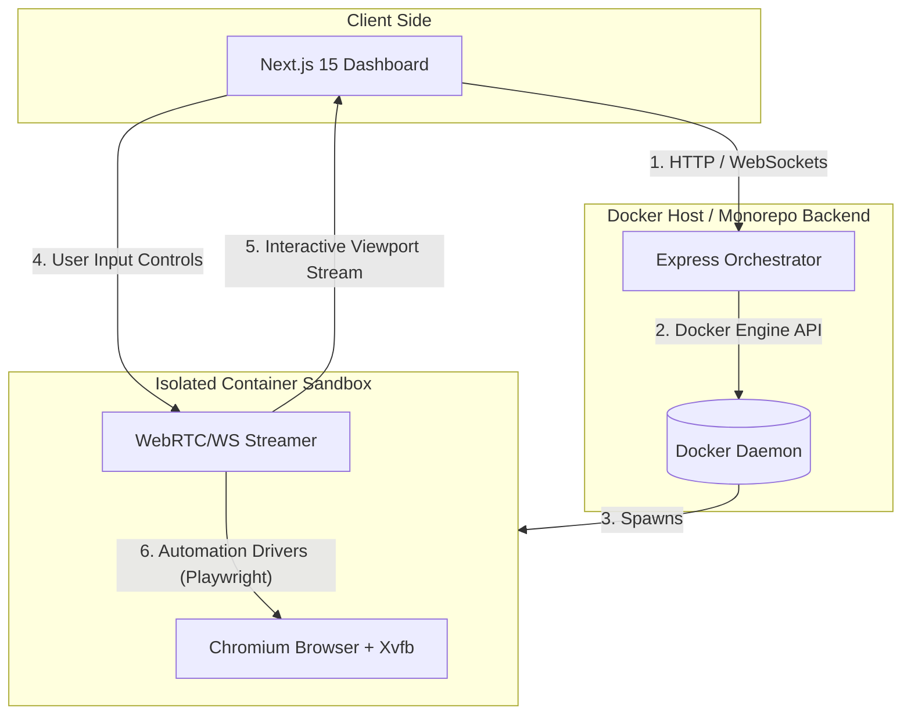
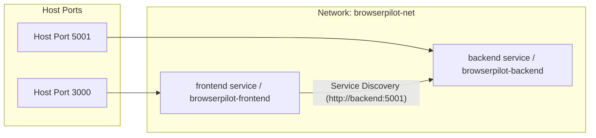

# BrowserPilot 🚀

BrowserPilot is a local browser virtualization platform that enables users to remotely control a Chromium browser running inside an isolated, containerized environment directly from a web dashboard.

---

## 📌 Project Overview
BrowserPilot runs a sandboxed Chromium instance inside a Docker container, captures its visual output, streams it in real-time to the frontend UI, and forwards user actions (mouse clicks, keyboard strokes, touch gestures) back to the browser via a WebSocket control plane.

### Key Features
* 📺 **Real-time Streaming:** Low-latency visual streaming of the containerized browser viewport.
* ⌨️ **Interactive Controls:** Mouse, keyboard, and touch event forwarding.
* 🛡️ **Complete Isolation:** Browsers run in separate Docker environments, ensuring local machine security.
* 🤖 **Automation Ready:** Hooked up with Playwright for programmatic task execution.

---

## 🏗️ Architectural Overview
The system is designed using a decoupled service architecture:



---

## 🛠️ Tech Stack
* **Frontend:** Next.js 15 (App Router), React, Tailwind CSS, TypeScript
* **Backend:** Node.js, Express, TypeScript, ts-node-dev
* **Infrastructure:** Docker, Docker Compose, Chromium

---

## 📈 Milestones & Roadmap

* **Epic 1 — Foundation** *(Current)*: Base workspace setup, Express boilerplate, Next.js scaffolding, dev script definition.
* **Epic 2 — Docker**: Containerization of Frontend and Backend services, development multi-stage Dockerfiles.
* **Epic 3 — Browser Container**: Creating the Chromium base image running inside an Xvfb virtual frame buffer.
* **Epic 4 — Backend Orchestration**: Backend Docker API integration to dynamically provision and kill browser containers.
* **Epic 5 — Streaming**: Setting up visual streaming (WebSockets or WebRTC) from Chromium to the UI.
* **Epic 6 — Controls**: Forwarding mouse and keyboard interactions from the Next.js frontend to the browser.
* **Epic 7 — Production Hardening**: Session persistence, multi-tenant container limits, logging aggregation, and security.

---

## 🚀 Development Setup

### Prerequisites
* Node.js (v18+)
* Docker & Docker Compose
* npm or pnpm

### Getting Started

1. **Clone the repository:**
   ```bash
   git clone <repo-url> browser-pilot
   cd browser-pilot
   ```

2. **Backend Development:**
   Navigate to the backend directory, install packages, and spin up the server:
   ```bash
   cd backend
   npm install
   npm run dev
   ```
   *The server runs at [http://localhost:5001](http://localhost:5001).*

3. **Frontend Development:**
   Navigate to the frontend directory, install packages, and boot up the Next.js app:
   ```bash
   cd ../frontend
   npm install
   npm run dev
   ```
   *The application will run at [http://localhost:3000](http://localhost:3000).*

---

## 🐳 Docker Orchestration & Infrastructure

We use a production-grade Docker architecture to containerize, isolate, and orchestrate the BrowserPilot platform services.

### 1. Docker Architecture

The setup consists of two main services communicating on an isolated custom bridge network:



* **Frontend Image:** Built using a 3-stage process (`deps` -> `builder` -> `runner`) using the Next.js `standalone` build option to achieve a minimal image size. Runs under the non-root `nextjs` user.
* **Backend Image:** Built using a 3-stage process (`builder` -> `deps` -> `runner`) transpiling TypeScript to ES2022 JavaScript. Runs under the non-root `node-user` user.

### 2. Container Lifecycle

* **Startup Sequencing:** The `frontend` service depends on the `backend` service becoming `healthy`. Docker Compose handles this via the `condition: service_healthy` rule.
* **Health Checks:**
  * **Backend:** Native `wget` queries the `GET /health` endpoint inside the container every 10 seconds.
  * **Frontend:** Native `wget` queries the landing page `/` (listening on port 3000) every 15 seconds.
  * Both checks resolve against the IPv4 loopback (`127.0.0.1`) to ensure compatibility with Alpine Linux's default dual-stack loopback resolution.
* **Restart Policy:** Services are configured with `restart: unless-stopped` to recover gracefully from crashes or runtime failures.

### 3. Networking & Service Discovery

* **Network Name:** `browserpilot-net`
* **Driver:** `bridge`
* **Service Discovery Strategy:** Under the custom bridge network, services resolve each other's hosts using their internal service names (`frontend` and `backend`). There are **no localhost assumptions** made between running containers.

---

## 🚀 Developer Command Matrix

We orchestrate local environment execution using Docker Compose. Use the following commands for the lifecycle management:

| Command | Action | Description |
| :--- | :--- | :--- |
| `docker compose build` | **Build** | Builds or rebuilds the Docker images from the source folders. |
| `docker compose up` | **Start** | Launches all services in the foreground, showing real-time log aggregates. |
| `docker compose up -d` | **Start (Detached)** | Launches all services in the background. |
| `docker compose down` | **Stop** | Stops and removes running containers, networks, and volumes. |
| `docker compose logs` | **Logs** | Displays log output from all active containers. |
| `docker compose up --build` | **Rebuild & Start** | Force rebuilds all container images and launches the stack. |

> [!NOTE]
> If you run on a host machine where the `docker` binary is not in the system path by default (e.g. macOS installations where `/usr/local/bin` is excluded), prepend or append the correct binary path or environment PATH variables:
> `export PATH=/usr/local/bin:$PATH`

---

## 🔍 Troubleshooting Guide

#### 1. Port Collision Error
* **Symptom:** `port is already allocated` or `address already in use`.
* **Resolution:** Ensure that no local instances of Next.js (port 3000) or Express (port 5001) are running on the host machine. You can find and terminate conflicting processes using:
  ```bash
  lsof -i :3000
  lsof -i :5001
  kill -9 <PID>
  ```

#### 2. Health Check Connection Refused (IPv6 Resolution Issues)
* **Symptom:** Docker container starts but is marked `unhealthy`, and container logs show `wget: can't connect to remote host: Connection refused`.
* **Resolution:** In Alpine base images, `localhost` resolves to both `127.0.0.1` (IPv4) and `::1` (IPv6). If the application server binds exclusively to IPv4, `wget` query falls back to IPv6 and receives connection refused. Always specify `127.0.0.1` explicitly in Dockerfile / Compose health check probes rather than `localhost`.

#### 3. Next.js Client-Side vs Server-Side API URL Resolution
* **Symptom:** Next.js dashboard is unable to fetch data from the Express backend inside Docker.
* **Resolution:** Next.js uses server-side data fetching and client-side data fetching. Build arguments compile client bundles with `NEXT_PUBLIC_API_URL` targeting the host IP or `http://localhost:5001` (accessible by user's browser), while server-side queries inside Docker should target `http://backend:5001` via bridge routing.

---

## 📜 License
MIT License.