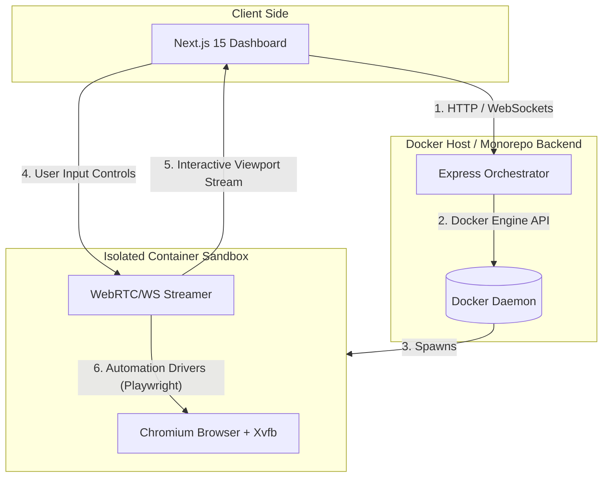

# BrowserPilot 🚀

BrowserPilot is a local browser virtualization platform that enables users to remotely control a Chromium browser running inside an isolated, containerized environment directly from a web dashboard.

---

## 📌 Project Overview
BrowserPilot runs a sandboxed Chromium instance inside a Docker container, captures its visual output, streams it in real-time to the frontend UI, and forwards user actions (mouse clicks, keyboard strokes, touch gestures) back to the browser via a WebSocket control plane.

### Key Features
* 📺 **Real-time Streaming:** Low-latency visual streaming of the containerized browser viewport.
* ⌨️ **Interactive Controls:** Mouse, keyboard, and touch event forwarding.
* 🛡️ **Complete Isolation:** Browsers run in separate Docker environments, ensuring local machine security.
* 🤖 **Automation Ready:** Hooked up with Playwright for programmatic task execution.

---

## 🏗️ Architectural Overview
The system is designed using a decoupled service architecture:



---

## 🛠️ Tech Stack
* **Frontend:** Next.js 15 (App Router), React, Tailwind CSS, TypeScript
* **Backend:** Node.js, Express, TypeScript, ts-node-dev
* **Infrastructure:** Docker, Docker Compose, Chromium

---

## 📈 Milestones & Roadmap

* **Epic 1 — Foundation** *(Current)*: Base workspace setup, Express boilerplate, Next.js scaffolding, dev script definition.
* **Epic 2 — Docker**: Containerization of Frontend and Backend services, development multi-stage Dockerfiles.
* **Epic 3 — Browser Container**: Creating the Chromium base image running inside an Xvfb virtual frame buffer.
* **Epic 4 — Backend Orchestration**: Backend Docker API integration to dynamically provision and kill browser containers.
* **Epic 5 — Streaming**: Setting up visual streaming (WebSockets or WebRTC) from Chromium to the UI.
* **Epic 6 — Controls**: Forwarding mouse and keyboard interactions from the Next.js frontend to the browser.
* **Epic 7 — Production Hardening**: Session persistence, multi-tenant container limits, logging aggregation, and security.

---

## 🚀 Development Setup

### Prerequisites
* Node.js (v18+)
* Docker & Docker Compose
* npm or pnpm

### Getting Started

1. **Clone the repository:**
   ```bash
   git clone <repo-url> browser-pilot
   cd browser-pilot
   ```

2. **Backend Development:**
   Navigate to the backend directory, install packages, and spin up the server:
   ```bash
   cd backend
   npm install
   npm run dev
   ```
   *The server runs at [http://localhost:5001](http://localhost:5001).*

3. **Frontend Development:**
   Navigate to the frontend directory, install packages, and boot up the Next.js app:
   ```bash
   cd ../frontend
   npm install
   npm run dev
   ```
   *The application will run at [http://localhost:3000](http://localhost:3000).*

---

## 📜 License
MIT License.